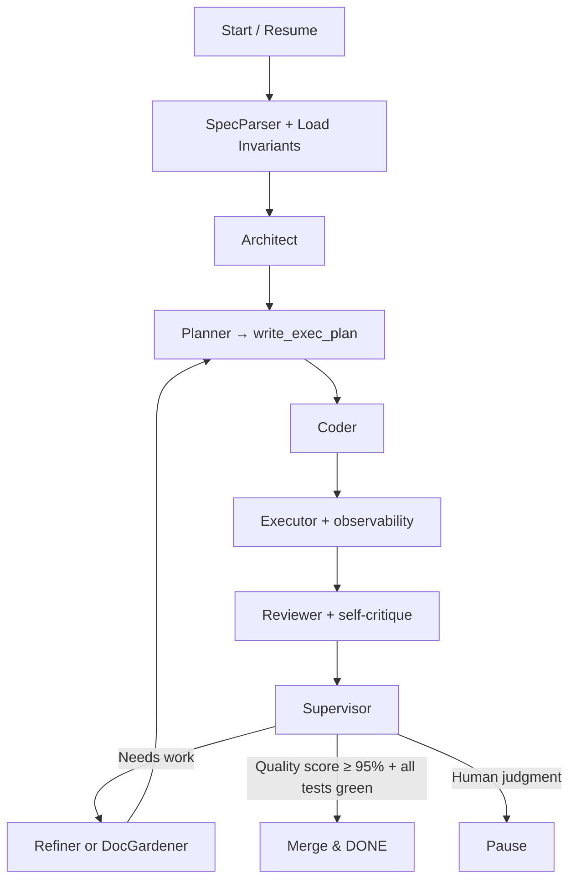

### Updated Design Spec: Spec-Driven Agentic Coder (v0.3 — Harness-Inspired)

#### Vision (One Sentence, Updated)
A LangGraph-powered, **repo-as-harness** agentic system that treats a Markdown spec as the living constitution, lets agents collaboratively plan, code, test, review, and self-maintain the entire codebase — inspired directly by OpenAI’s internal Harness, but built for cheap Chinese models and full traceability.

#### Core Principles (New/Strengthened)
- **Repo is the harness**: All state, plans, docs, and invariants live in git. The graph is just the orchestration layer.
- **Progressive disclosure**: Agents start with `spec.md` + `AGENTS.md` (our TOC), then drill into `exec-plans/`, `design-docs/`, etc.
- **Mechanical enforcement**: Linters, tests, and doc gardening > manual review.
- **Long-running autonomy**: The graph is designed for 6+ hour runs with checkpoints every iteration.

#### High-Level State (Minor Updates)
```python
class AgentState(TypedDict):
    spec_path: str
    spec_content: str
    spec_structure: dict
    codebase: dict[str, str]          # now includes auto-generated docs
    plan: list[dict]                  # synced to exec-plans/current.md
    test_results: list[dict]
    issues: list[str]
    iteration: int
    next: str
    checkpoint: dict
    mcp_servers: list[str]
    quality_score: float              # new: tracked in quality-score.md
    invariants: list[str]             # linter rules loaded from repo
```

#### Nodes / Roles (Small Evolution)

| Node              | Update from v0.2 |
|-------------------|------------------|
| **Planner**       | Now writes `exec-plans/current.md` on every run |
| **Reviewer**      | Performs full agent-style PR review (style, invariants, spec alignment) |
| **Executor**      | Gains observability tools (logs, metrics) |
| **Refiner**       | Can also propose new linter rules or invariants |
| **DocGardener**   | *New node* (optional, runs after Supervisor) — cleans stale plans/docs |

Supervisor now has a stronger “harness maintenance” mode.

#### Tools (Enhanced with Harness Ideas)

**Core Tools** (same)  
**MCP Ecosystem** (same + new)  
**New Harness Tools** (added to the shared belt):

| Tool | Description | Inspired By |
|------|-------------|-------------|
| `write_exec_plan` | Creates/updates `exec-plans/*.md` with progress | Execution plans |
| `run_linter` | Runs repo-defined linters, injects fixes into context | Enforceable invariants |
| `query_observability` | Agents can ask “show me latency of the last run” | Agent observability |
| `doc_garden` | Finds and proposes fixes for stale/out-of-sync docs | Doc gardening |
| `record_validation` | Saves screenshots/videos of test runs (via MCP) | Video repro in post |

#### Graph Flow (Slightly Refined)


